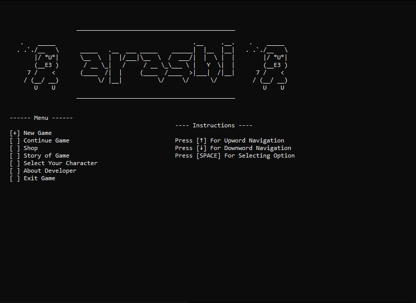

# 🌪️ Arashi - Ninja CLI Game

**Semester 1 - Programming Fundamentals (C++) Project**  
**Author:** *Hafiz Muhammad Moaz 2024-cs-23*  
**Language:** C++ (Command Line Interface)  
**Project Type:** Text-based animated game (CLI)

---

## 🎮 Game Overview

**Arashi** is a simple CLI-based action game built in C++, featuring a ninja character with dynamic movements and interactions. Designed as a Programming Fundamentals course project, Arashi showcases core concepts like OOP, control structures, animation using CLI characters, and basic game logic.



---

## 🧙‍♂️ Features

- ✅ **Playable Ninja Character:**
  - Walk, jump, fight, and fire mechanics
  - Smooth CLI-based animations

- ✅ **Enemy AI:**
  - Multiple enemy types with distinct designs:
    - Sword enemies
    - Shield-bearing enemies
  - Each enemy has animations and moves randomly

- ✅ **Game Mechanics:**
  - Fireballs from the ninja to attack enemies
  - Health system (player and enemies)
  - Lives system with respawn logic
  - Room-based level design for progression

- 🔄 **Random Elements:**
  - Randomized enemy spawn/movement for replayability

- 🔜 **To-Do:**
  - Damage system for ninja's melee attacks (currently under development)

---

## 🛠️ How It Works

- Runs in the Command Line (Windows/Linux terminal)
- Uses basic C++ concepts like:
  - Classes and objects
  - Arrays and loops
  - ASCII-based frame rendering

---

## 🧪 How to Run

1. **Compile the project** using a C++ compiler:
   ```bash
   g++ main.cpp -o arashi

2. **Run**
   ```bash
   arashi

---

## 📌 Notes

- This is a CLI-based game; no graphics libraries are used.
- Works best in a terminal that supports ANSI escape sequences (for animations).
- Created purely for educational purposes.

## 📈 Future Improvements

- Implement attack damage on melee
- Add boss fights
- Sound (beep) support for hits
- Save/load game feature
- Score tracking

## 📚 Acknowledgements

- Thanks to PF course mentors and peers for feedback and testing.
- Inspired by retro ASCII games and ninja lore.
