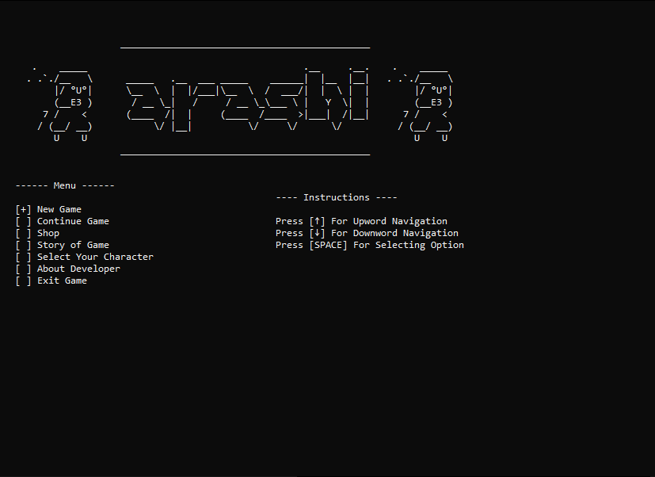

# Arashi - Ninja CLI Game

**Semester 1 - Programming Fundamentals (C++) Project**  
**Author:** *Hafiz Muhammad Moaz 2024-cs-23*  
**Language:** C++ (Command Line Interface)  
**Project Type:** Text-based animated game (CLI)

---

## Game Overview

**Arashi** is a simple CLI-based action game built in C++, featuring a ninja character with dynamic movements and interactions. Designed as a Programming Fundamentals course project, Arashi showcases core concepts like OOP, control structures, animation using CLI characters, and basic game logic.



---

## Features

- **Playable Ninja Character:**
  - Walk, jump, fight, and fire mechanics
  - Smooth CLI-based animations
  - Drawn in bright green so the hero always stands out

- **Enemy AI:**
  - Multiple enemy types with distinct designs:
    - Sword enemies
    - Shield-bearing enemies
  - Each type is color-coded (red / yellow / blue) for clarity
  - Each enemy has animations and moves randomly

- **Game Mechanics:**
  - Fireballs from the ninja to attack enemies
  - Health system (player and enemies)
  - Lives system with respawn logic
  - Coin economy: collect coins from gems and kills
  - **Ammo refill:** press **R** to trade coins for bullets
  - Solid collision: ramps and platforms block movement, and the player can no longer walk through enemies

- **Combat:**
  - Fire to kill enemies; shield-bearing enemies block shots to their front, so
    flank them or use a melee sword swing (Down/S) up close
  - Melee swing damages enemies within reach

- **Endless Progression:**
  - Clear enemies and keep running right — the world never ends, with rising difficulty
  - Levels are generated procedurally, so every run's layout differs

- **Random Elements:**
  - Randomized enemy spawn/movement and level layout for replayability

---

## Controls

| Action        | Keys              |
| ------------- | ----------------- |
| Move          | Arrow keys / A, D |
| Jump          | Up / W            |
| Sword (melee) | Down / S          |
| Shoot         | Space             |
| Refill ammo   | R (spends coins)  |
| Pause         | P (R resumes)     |
| Exit          | Esc               |

---

## How It Works

- Runs in the Command Line (Windows/Linux terminal)
- Uses basic C++ concepts like:
  - Classes and objects
  - Arrays and loops
  - ASCII-based frame rendering

---

## How to Run

1. **Compile the project** using a C++ compiler (link `winmm` for background audio):
   ```bash
   g++ arashi.cpp -o arashi -lwinmm
   ```
   In VS Code, the build task (Ctrl+Shift+B / F5) already passes `-lwinmm`.

2. **Run**
   ```bash
   arashi
   ```

> The game window opens at a fixed size (120x40) and builds every level
> procedurally — there are no map files to manage.

---

## Notes

- This is a CLI-based game; no graphics libraries are used.
- Works best in a terminal that supports ANSI escape sequences (for animations).
- Created purely for educational purposes.

## Future Improvements

- Add boss fights
- Smooth pixel-by-pixel scrolling (currently section/screen-based)
- Sound effects for hits (background music is implemented via `winmm`)
- Save/load progress between runs

## Acknowledgements

- Thanks to PF course mentors and peers for feedback and testing.
- Inspired by retro ASCII games and ninja lore.
